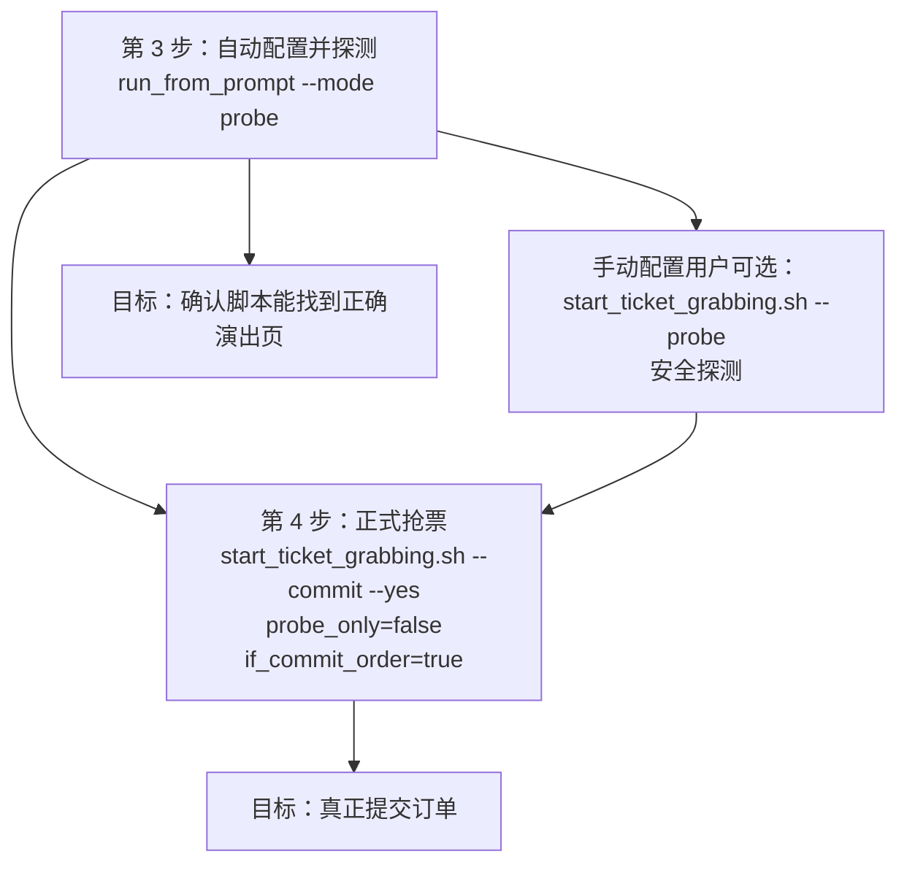

# ComeTickets v0.5.0 - 大麦抢票自动化

ComeTickets 不是票务展示站，而是一个通过 Android 真机控制大麦 App 的自动抢票工具箱。

> **版本状态**：当前发布版本为 `v0.5.0`。`master` 已包含发布后的预填极速路径、分阶段耗时统计和提交结果 fail-closed 验证增强；正式下单仍必须显式使用 `--commit`。

> ✅ **适合你**：有一台安卓真机、能用命令行（会敲 `adb` / `poetry`）、想给自己或家人抢票。
> ⛔ **不适合你**：没有安卓真机（iOS / 纯 PC / Mac 无真机都跑不了）、完全没碰过命令行、或期待“装个 App 点一下就抢”。这是一套需要动手配置的自动化工具，不是开箱即用的成品软件。

## 目录

- [适用人群与准入门槛](#适用人群与准入门槛)
- [风险与合规提示](#风险与合规提示)
- [推荐环境](#推荐环境) · [当前版本能力](#当前版本能力) · [方案状态](#方案状态) · [三个旗标的语义](#三个旗标的语义)
- [五分钟跑通 Mobile](#五分钟跑通-mobile)（新用户从这里开始）
- [退出码与运行摘要](#退出码与运行摘要)（无人值守 / 多设备编排）
- [常见问题](#常见问题)
- [其他方案](#其他方案) · [项目结构](#项目结构) · [开发与测试](#开发与测试)

## 适用人群与准入门槛

开始前请确认你**同时**满足下面的硬性条件，任一不满足都跑不通，不必往下折腾：

| 门槛 | 说明 |
| --- | --- |
| 安卓真机 | Android 12~14 真机（模拟器易被风控）。**iOS、纯 PC / Mac 无真机均不可用** |
| 命令行基础 | 会在终端敲命令、能看懂报错；本工具没有图形界面 |
| adb 可用 | 电脑已装 `adb` 且 `adb devices` 能看到手机（不会装见[常见问题](#常见问题)第 1 条） |
| 大麦已就绪 | 真机上大麦 App 已登录，且**观演人已提前在 App 内添加成功**（怎么加见[常见问题](#常见问题)第 4 条） |

## 风险与合规提示

- **账号风险**：自动化操作可能触发大麦风控，存在**限流甚至封号**的可能；模拟器比真机更容易触发。请自行评估后再用。
- **仅限个人正当使用**：请勿用于黄牛倒票，或任何违反平台规则与法律法规的用途。
- **风险自负**：一旦使用即代表你已知悉并自行承担全部后果，完整说明见 [DISCLAIMER.md](./DISCLAIMER.md)。

## 推荐环境

| 组件      | 推荐版本                                  |
| --------- | ----------------------------------------- |
| Python    | 3.10 ~ 3.13（CI 已覆盖；3.8/3.9 受限支持） |
| Poetry    | 1.7+                                      |
| Android   | 12 ~ 14 真机（模拟器易被风控）             |

> ⚠ Python 3.14 暂不支持：`uiautomator2` 与 `selenium` 上游尚未发布预编译 wheel（issue #21）。

## 法律说明

- 开源协议：见 [LICENSE](./LICENSE)
- 版权与商标声明：见 [NOTICE](./NOTICE)
- 免责申明：见 [DISCLAIMER.md](./DISCLAIMER.md)

## 当前版本能力

- `Mobile`：当前唯一主推方案，使用 UIAutomator2 直连 Android 真机，无需 Appium 服务
- `安全闸门`：`--probe` 绝不下单；只有 `--commit` 能授权提交订单
- `预填极速路径`：可在预约页预填场次、票档、数量和观演人，开售前提前进入 SKU 页
- `可观测性`：记录页面探测、等待开售、SKU 跳转、提交与验证等阶段耗时，并输出 `run_summary.json`
- `失败保护`：提交后未确认支付页时返回 `submit_unverified` 并停止重试，避免重复下单
- ~~`Web`~~：**已移除** — 大麦网页端风控升级后 Selenium 方案已不可用，代码已从仓库删除
- `Desktop`：**已被官方渠道限制，当前视为不可用，不再推荐，也不要作为主流程投入时间**

## 方案状态

| 方案          | 目录           | 当前状态   | 说明                                                   |
| ------------- | -------------- | ---------- | ------------------------------------------------------ |
| `Mobile`      | `mobile/`      | 主推       | UIAutomator2 直连 Android 大麦 App，无需额外服务       |
| ~~`Desktop`~~ | ~~`desktop/`~~ | ~~不可用~~ | ~~官方渠道和风控已限制，当前不要再作为可执行方案使用~~ |

> 如果你是第一次用，直接走 `Mobile + 安卓真机`。
> 如果你是手动配置用户，想先验证流程，直接用 `./mobile/scripts/start_ticket_grabbing.sh --probe`。
> 如果你看到旧文档里提到 `Desktop`，把它理解成“历史实现”，不要再按它准备环境。

**当前主流程按 `Mobile + 安卓真机` 设计。**

先定位目标演出，再进入票档页和确认页；如果 `auto_navigate=true`，脚本会用 `keyword` 从大麦首页自动搜索进入目标演出。

现在命令语义固定为：

- `./mobile/scripts/start_ticket_grabbing.sh --probe`：安全探测
- `./mobile/scripts/start_ticket_grabbing.sh --commit --yes`：正式抢票

### 三个旗标的语义

| 旗标 | 含义 |
| --- | --- |
| `--probe` | 安全探测：停在“立即购票/立即预订”之前，绝不点击、绝不下单 |
| `--commit` | 正式抢票：**唯一**会把配置改写为真实下单（`if_commit_order=true`）并提交订单的旗标 |
| `--yes` / `-y` | 仅跳过普通 y/N 交互确认；**不再能单独触发真实下单**——漏敲 `--probe` 不会误付款，脚本会直接报错退出 |

补充规则：

- `--probe` 与 `--commit` 互斥，同时给出会报错退出
- `--commit` 不带 `--yes` 时，需要手动输入确认词（`GO` 或配置里的 `keyword` 原文）
- `--commit` 路径无论是否带 `--yes`，启动前都会打印下单摘要（演出/票档/观演人/场次）并倒数 3 秒，`Ctrl-C` 可随时取消
- 两个旗标都不带时：交互终端会进入强确认闸门，非交互环境直接报错退出

如果当前配置里的 `probe_only / if_commit_order` 和你执行的命令不一致，脚本会先用醒目的日志提醒你，再改写配置并继续执行。

## 推荐阅读顺序

1. 先看下面的 `五分钟跑通 Mobile`
2. 再看 [docs/quick-start.md](docs/quick-start.md)
3. 需要深入理解脚本时，再看 [docs/mobile-ticket-logic.md](docs/mobile-ticket-logic.md)

## 五分钟跑通 Mobile

按当前代码，最稳定的路线就是这一条：

1. 连接安卓真机，并保持大麦 App 已登录
2. 自动配置并直接做一次安全探测
3. 探测通过后，再进入正式抢票

这 2 个用户阶段一定要区分清楚：

1. `./mobile/scripts/start_ticket_grabbing.sh --probe`
   只是探测。会自动打开目标演出页，但会停在“立即购票/立即预订”之前，不会真正点击。（自动化场景可加 `--yes` 跳过确认）
2. `./mobile/scripts/start_ticket_grabbing.sh --commit --yes`
   才是正式提交模式，会打印下单摘要、倒数 3 秒后尝试提交订单。

### 1. 安装依赖

```bash
poetry install
```

如果你还没有 Android SDK，建议直接安装 Android Studio（需要 `adb` 命令可用）。

### 2. 连接手机

手机前置条件：

- 已打开 `开发者选项`
- 已打开 `USB 调试`
- 已安装并登录大麦 App

连接后执行：

```bash
adb devices
```

输出里类似 `ABC1234567	device` 的这一串，就是你的 `serial`（配置文件中的设备序列号字段）。

### 3. 准备本地配置

开始前先确认这两件事：

- 真机里已经安装并登录大麦 App
- 你要用到的观演人已经在大麦 App 里添加成功（不会加见[常见问题](#常见问题)第 4 条）

#### 3.1 自动配置

如果你不想一开始就手改配置，可以先用自然语言入口。前面 2 个步骤都完成后，再看这一节。

先记住这几条：

- 常用模式都建议直接写清楚观演人姓名
- 如果提示词里没写观演人，脚本会立即停止
- 如果你已经写了多个观演人，但没额外写“2张”，脚本会自动按观演人数推断购票数量
- 只有当你手动写了张数、且和观演人数不一致时，脚本才会停止
- 这种情况下不会继续搜索、连接设备，也不会写配置
- 脚本会直接打印“可复制的正确命令”和“规范提示词”，你按输出替换后重试即可
- 如果当前只连接了一台安卓设备，脚本会自动识别并临时修正 `serial`
- 在 `apply / probe` 模式下，设备序列号也会一起写回 `mobile/config.jsonc`
- 推荐提示词格式：`给张三和李四抢4 月 6 号张杰的北京站演唱会内场门票，票价 1680 元`
- 使用时请把 `张三`、`李四` 替换成你自己已经在大麦 App 中添加成功的真实观演人姓名

常用 3 个模式的关系要先看清楚：

- `summary`：只预览，不写配置
- `apply`：写入 `mobile/config.jsonc`，适合你想自己再检查一遍配置
- `probe`：写入 `mobile/config.jsonc`，并直接执行一次安全探测

和后面章节的对应关系是：

- `probe` 对应 [3.2 手动配置](#32-手动配置) 末尾的安全探测
- 正式抢票见 [4. 正式提交前再确认一次](#4-正式提交前再确认一次)；为了避免误下单，`run_from_prompt` 不直接提供自动提交模式

如果你只是想先看看 AI 识别得对不对，运行：

```bash
./mobile/scripts/run_from_prompt.sh --mode summary --yes "给张三和李四抢4 月 6 号张杰的北京站演唱会内场门票，票价 1680 元"
```

注意：

- `summary` 能稳定给出搜索候选
- 日期和票档摘要取决于页面当前是否已经展开到可识别状态，显示 `未识别` 也算正常，不代表脚本失效

如果你确认摘要结果没问题，并且想只生成配置文件，运行：

```bash
./mobile/scripts/run_from_prompt.sh --mode apply --yes "给张三和李四抢4 月 6 号张杰的北京站演唱会内场门票，票价 1680 元"
```

执行完 `apply` 后，直接跳到 [4. 正式提交前再确认一次](#4-正式提交前再确认一次) 继续即可，不需要再回头看 3.2。

如果你想“生成配置 + 直接做安全探测”，运行：

```bash
./mobile/scripts/run_from_prompt.sh --mode probe --yes "给张三和李四抢4 月 6 号张杰的北京站演唱会内场门票，票价 1680 元"
```

这就是普通用户最推荐的探测方式。
也就是说，如果你已经在用自然语言入口，通常**不需要**再单独执行一次 `./mobile/scripts/start_ticket_grabbing.sh --probe`。

#### 3.2 手动配置

如果你没有用 3.1 自动生成配置，或者你已经用 3.1 生成过配置、现在只是想手动检查和微调，再看这一节。

第一步永远是从模板复制出你的配置文件（`mobile/config.jsonc` 不入库，模板才是唯一口径）：

```bash
cp mobile/config.example.jsonc mobile/config.jsonc
```

然后把下面这几个字段改成你自己的真实值：

<!-- CONFIG_EXAMPLE:BEGIN -->
```jsonc
{
  // adb devices 显示的设备序列号
  "serial": "你的设备序列号",
  // 在大麦 App 内搜索目标演出的关键词（必填，不能为 null）
  "keyword": "张杰 演唱会",
  // 必须是你已经在大麦 App 中添加成功的观演人；人数 = 购票张数
  "users": ["你的真实观演人姓名"],
  "city": "演出城市",
  "date": "场次日期",
  "price": "票档原文",
  "price_index": 0,
  "probe_only": true,
  "if_commit_order": false,
  "auto_navigate": true
}
```
<!-- CONFIG_EXAMPLE:END -->

字段说明只记最关键的：

- `serial`：`adb devices` 输出的设备序列号
- `keyword`：必填，不能为空或 `null`；脚本用它在大麦 App 内搜索目标演出
- `users`：必须是你已经在大麦 App 里添加成功的真实观演人；人数就是购票张数
- `city / date / price`：尽量按 App 页面上的原文填写
- `price_index`：文本匹配失败时的兜底索引，从 `0` 开始
- `probe_only=true`：脚本内部使用的探测标记；普通用户优先使用 `--probe`
- `if_commit_order=false`：脚本会继续到确认页并执行观演人勾选校验，但会停在“立即提交”前；正式抢票时 `start_ticket_grabbing.sh --commit` 会自动改成 `true`
- `auto_navigate=true`：允许脚本从首页/搜索页自动进入目标演出
- `prefilled_detail_entry_lead_ms`：预填模式提前进入 SKU 页的时间，模板默认 `300` 毫秒；设为 `0` 可关闭提前进入
- `use_prefilled_selection=true`：仅适用于已在预约页预填场次、票档、数量和观演人的实战路径，会跳过这些状态的常规校验

如果你是手动配置用户，完成这一步后，可以直接用下面这条命令做一次安全探测：

```bash
./mobile/scripts/start_ticket_grabbing.sh --probe
```

探测通过的标志是：

- 脚本能自动控制大麦 App
- 能自动定位到目标演出页
- 在购票点击前停止

如果你执行后看到脚本停在详情页，不代表脚本坏了；这正是 `--probe` 的预期行为。

开发者补充说明：

- `mobile/config.local.jsonc` 是可选的本地覆盖配置
- 它不会提交到 GitHub，适合开发调试时放真机参数
- 普通用户默认始终使用 `mobile/config.jsonc`
- 如果你是开发者，需要显式通过 `--config mobile/config.local.jsonc` 或 `HATICKETS_CONFIG_PATH=mobile/config.local.jsonc` 才会启用本地覆盖配置

#### 3.3 如果演唱会 12:00 开抢，建议几点启动脚本

这个项目不是“11:59:59 再手忙脚乱点一次”的思路，而是**提前把环境和页面准备好，再在开售瞬间进入热路径**。

实操建议：

- 如果你已经手动停在目标演出详情页或票档页：提前 **1 到 2 分钟**
- 如果你还要依赖自动导航、自动搜索、自动切页：提前 **3 到 5 分钟**
- 如果是第一次跑、网络一般、手机状态不稳定：提前 **5 分钟以上**

也就是说，如果开抢时间是 `12:00`，最稳妥的做法是：

- 至少在 **11:58** 前启动 `./mobile/scripts/start_ticket_grabbing.sh --commit --yes`
- 更保守一点，直接在 **11:55 到 11:58** 之间启动

推荐配置分两种：

1. 你知道精确开抢时间
   这是最推荐的方式。脚本会在开抢前 `countdown_lead_ms` 毫秒进入紧密轮询。

```jsonc
"sell_start_time": "2026-04-06T12:00:00+08:00",
"countdown_lead_ms": 3000,
"wait_cta_ready_timeout_ms": 0
```

这组配置的含义是：

- 精确等到 `12:00`
- 从 `11:59:57` 开始高频轮询
- 不走“最长等待 CTA 60 秒”的备用策略

2. 你不知道精确开抢时间，但会手动停在倒计时详情页
   这时可以不填 `sell_start_time`，改用 CTA 等待模式。

```jsonc
"sell_start_time": null,
"wait_cta_ready_timeout_ms": 60000
```

这组配置适合“我会提前守在详情页，等按钮从倒计时变成立即购买”的场景，但也更容易让人误以为脚本卡住了。对大多数普通用户来说，如果你已经知道开抢时间，优先用第一种配置。

3. 已在预约页完成预填，需要走当前版本的极速路径

```jsonc
"sell_start_time": "2026-04-06T12:00:00+08:00",
"prefilled_detail_entry_lead_ms": 300,
"use_prefilled_selection": true,
"auto_navigate": false
```

该模式会在开售前提前进入 SKU 页，开售时直接执行“下一步”和提交，并跳过票档、数量及观演人状态的常规校验。只应在你已经人工确认预填内容完全正确时启用；首次使用或普通自动导航场景请保持 `use_prefilled_selection=false`。

### 4. 正式提交前再确认一次

这一步才是**真正的抢票**。

建议你把它理解成：

- 第 3 步验证”脚本能不能找到正确的演出页”
- 第 4 步才是”允许脚本真正提交订单”

如果你是从 3.1 自动配置开始的，到了这里通常不需要重新生成配置，直接执行：

```bash
./mobile/scripts/start_ticket_grabbing.sh --commit --yes
```

这条命令会固定按“正式抢票”运行；启动前会打印下单摘要（演出/票档/观演人/场次）并倒数 3 秒，`Ctrl-C` 可随时取消。如果你不加 `--yes`，脚本还会要求你手动输入确认词（`GO` 或配置里的 `keyword` 原文）。

> ⚠️ 旧命令 `./mobile/scripts/start_ticket_grabbing.sh --yes`（不带 `--commit`）已不再触发真实下单，会直接报错并给出迁移指引——这是刻意的资金误操作防护。

如果你当前配置里还是：

```jsonc
"probe_only": true,
"if_commit_order": false
```

脚本会先给出醒目的提示，再自动把它们改成：

```jsonc
"probe_only": false,
"if_commit_order": true
```

然后继续执行。

预期逻辑是：

1. 脚本读取你在第 3 步已经探测通过的配置
2. 自动进入目标演出页或直接从当前页继续
3. 自动选择场次、票档、数量和观演人
4. 到达“确认购买”页
5. 这一次会继续点击“立即提交”
6. 如果下单成功，通常会进入支付页；后续支付需要你自己完成

可以把 4、5 两步理解成这张图：



第 4 步最容易出问题的地方，也建议你在开始前再核对一次：

- `users` 是否就是本次实际要购票的观演人
- `price` 和 `price_index` 是否已经在前面的探测和人工检查里确认过
- 当前票档是不是可买状态，而不是“缺货登记”或“预约”
- 手机和网络是否稳定，且大麦 App 仍然保持登录

如果第 4 步失败，优先这样排查：

1. 如果目标项目已经开售，但根本没有进入确认页，通常是 `price / price_index / city / date` 其中一项没对上
2. 如果进入确认页但没提交成功，先检查是否触发了验证码、库存不足或已有未支付订单
3. 如果跳到了别的演出页，说明当前页面状态不干净，先回到大麦首页再重新执行
4. 如果日志里提示找不到观演人，先确认这些观演人已经在大麦 App 中添加并保存成功

如果你知道演唱会是 `12:00` 开抢，第 4 步开始前再记住这一条：

- 不要等到 `11:59:59` 才运行脚本
- 已经验证过流程的情况下，至少提前 **1 到 2 分钟**
- 需要自动导航或想更稳一点，提前 **3 到 5 分钟**
- 绝大多数场景下，**11:55 到 11:58 启动**会比掐秒启动更稳

## 退出码与运行摘要

> ⚠️ **行为变更（U-12）**：`python -m damai_app` 及 `start_ticket_grabbing.sh` 失败时不再恒 `exit 0`，而是返回下表的语义化退出码。依赖「总是退出码 0」的旧 cron/脚本需要按本节迁移。

### 运行层退出码（python -m damai_app，脚本原样穿透）

| 退出码 | 含义 | 编排器建议动作 |
|-------|------|--------------|
| `0` | 成功（探测就绪 / 验证就绪 / 已提交订单 / 检测到待支付订单 / 探测发现账号既有未支付订单） | 结束 |
| `10` | 所有重试失败（可重试型失败） | 可安全自动重启重试 |
| `11` | 不可重试失败（`sold_out` / `session_invalid` / `session_not_found` / `reservation_only` / `attendee_unselected` / `submit_unverified`） | **绝不自动重启**——`submit_unverified` 场景重启可能重复下单 |
| `12` | 配置或设备错误（配置解析/校验失败、设备连接失败、运行期设备异常） | 修复环境后再试；不建议盲目自动重启 |
| `13` | reserved：实例互斥冲突（U-15 落地后启用，当前任何路径不会返回） | — |
| `130` | 用户中断（Ctrl-C / SIGINT） | 人为取消，无需处理 |

脚本自身的 pre-flight 失败仍使用退出码 `1-4`（`1`=参数/配置/取消、`2`=Poetry 缺失、`3`=依赖安装失败、`4`=Python 版本不符），与运行层的 `10+` 数值不冲突——编排器按 `>= 10` 判定为运行层结果。

### 机器可读运行摘要（run_summary.json）

每次 run 结束（含失败与 Ctrl-C 中断）都会原子写出一份 JSON 摘要，默认路径 `mobile/tmp/run_summary.json`（「最近一次 run」语义，已 gitignore）；可用 `--result-json <path>` 或环境变量 `HATICKETS_RESULT_JSON` 覆盖（需保留历史请带时间戳路径）。

| 字段 | 含义 |
|------|------|
| `schema_version` | 摘要 schema 版本，当前 `1` |
| `outcome` | `probe_ready` / `validation_ready` / `order_submitted` / `order_pending_payment` / `preexisting_pending_order`（探测到账号既有未支付订单，非本次提交）/ `success`（兜底）/ `retries_exhausted` / `terminal_failure` / `config_or_device_error` / `interrupted` |
| `exit_code` | 与进程退出码一致 |
| `serial` | 本次生效的设备序列号（含 `--serial` 覆盖后的值），未配置为 `null` |
| `mode` | `probe` / `validation` / `submit`；初始化失败时为 `null` |
| `attempts` | 总执行轮次：外层尝试与快速重试各计 `1`（如外层 3 次 + 每次 8 轮快速重试全失败 = 27） |
| `duration_ms` | 进程内运行总耗时（毫秒） |
| `terminal_reason` | 不可重试原因或 `init_error: ...` / `run_error: ...` / `keyboard_interrupt`；无则 `null` |
| `started_at` / `finished_at` | 本地时区 ISO 时间戳 |

示例：

```json
{
  "schema_version": 1,
  "outcome": "probe_ready",
  "exit_code": 0,
  "serial": "emulator-5554",
  "mode": "probe",
  "attempts": 1,
  "duration_ms": 8432,
  "terminal_reason": null,
  "started_at": "2026-07-10T11:55:01+08:00",
  "finished_at": "2026-07-10T11:55:09+08:00"
}
```

写摘要失败（目录不可写、磁盘满）只记 warning，绝不影响退出码。

### --serial：同一份 config 复用到多台设备

`--serial` 只经环境变量 `HATICKETS_SERIAL` 透传给 `Config.load_config`，**不会改写配置文件**；同一份 config 可被 N 台设备复用：

```bash
./mobile/scripts/start_ticket_grabbing.sh --probe --yes --serial emulator-5554
./mobile/scripts/start_ticket_grabbing.sh --probe --yes --serial emulator-5556 --result-json /tmp/dev2.json
```

脚本会先用 `adb devices` 精确校验 `--serial` 指定的设备在线（不存在/未授权/离线立即 `exit 12`，避免 u2 长超时）。也可以直接设环境变量（对 `run_from_prompt.sh` 等走同一 `Config.load_config` 的入口同样生效）：

```bash
HATICKETS_SERIAL=emulator-5554 HATICKETS_RESULT_JSON=/tmp/run.json \
  ./mobile/scripts/start_ticket_grabbing.sh --probe --yes
```

环境变量为空/纯空白时视为未设置，回落配置文件的 `serial` 字段。

### 无人值守编排示例（systemd / cron）

```ini
# systemd unit 片段：失败自动重启，但对「不可重试失败」与「配置/设备错误」绝不重启
[Service]
ExecStart=/path/to/ComeTickets/mobile/scripts/start_ticket_grabbing.sh --probe --yes --serial emulator-5554
Restart=on-failure
RestartPreventExitStatus=11 12
```

```bash
# cron / shell 编排：按退出码分流
./mobile/scripts/start_ticket_grabbing.sh --probe --yes --serial "$SERIAL"
case $? in
    0)  echo "成功" ;;
    10) echo "重试耗尽，可切换备用设备重跑" ;;
    11) echo "不可重试失败（勿自动重跑，可能重复下单）"; exit 1 ;;
    12) echo "配置/设备错误，检查环境" ;;
esac
```

## 常见问题

### 1. `adb: command not found`

说明 `adb` 不在环境变量里。最简单的办法（macOS，无需安装 Android Studio、无需设置 `ANDROID_HOME`）：

```bash
brew install android-platform-tools
```

启动脚本只要求 `adb` 在 `PATH` 中即可，`ANDROID_HOME` 未设置不再报错。
如果你已安装 Android Studio，也可以：

```bash
export ANDROID_HOME="$HOME/Library/Android/sdk"
export ANDROID_SDK_ROOT="$ANDROID_HOME"
export PATH="$ANDROID_HOME/platform-tools:$PATH"
```

### 2. `adb devices` 看不到手机

先检查：

1. 手机有没有打开 `USB 调试`
2. 数据线是不是只能充电不能传数据
3. 手机上有没有点“允许调试”

### 3. 打开大麦后提示“访问被拒绝”

这通常是风控，不一定是代码问题。
模拟器比真机更容易触发，所以推荐用真机。

### 4. 脚本找不到观演人

最常见原因是：

- `mobile/config.jsonc` 里的 `users` 写的是占位符，不是真实名字
- 你的大麦账号里还没有配置对应观演人

**如何在大麦 App 里添加观演人**：打开大麦 App →「我的」→「观演人 / 常用观演人」→「添加」，填写真实姓名与证件信息并保存。配置里的 `users` 必须与这里保存的姓名**逐字一致**（含中英文、空格），`users` 的人数就是购票张数。

### 5. 脚本没有进入确认页

通常先查这几项：

1. `price` 文本是不是填错了
2. `price_index` 是不是和实际票档不一致
3. 当前票档是不是“缺货登记”而不是可买状态

### 6. 为什么脚本停在详情页，没有继续点“立即购票”

最常见的原因不是脚本坏了，而是当前还在安全探测模式。

先看你执行的是不是这条命令：

```bash
./mobile/scripts/start_ticket_grabbing.sh --probe --yes
```

如果是，这就是预期行为。`--probe` 会故意停在详情页购票按钮前，不会真正点击。

如果你想正式开始抢票，直接执行：

```bash
./mobile/scripts/start_ticket_grabbing.sh --commit --yes
```

如果当前配置里还是探测模式，这条命令会先用醒目的日志提示你，把配置切到正式抢票模式，并在打印下单摘要、倒数 3 秒后再继续执行。

另外再检查：

1. `wait_cta_ready_timeout_ms` 是否设置得过大，导致脚本还在等待 CTA 就绪
2. `city` 是否和详情页上的实际文本不一致，导致预选失败
3. 当前项目是否其实还是“预约/预售”流程，而不是真正可下单流程
4. 当前项目是不是只支持 App，不支持 H5 / Web

## 其他方案

### Desktop 端

`Desktop` 方案保留代码和历史文档，但当前已经不作为可用方案推荐。

原因很简单：

- 这条路线依赖大麦 H5 / mtop 接口
- 当前官方渠道限制和风控已经让这条方案失去稳定可用性
- 继续折腾 `desktop` 的投入产出很差

如果你只是想真正跑通抢票流程，请回到上面的 [五分钟跑通 Mobile](#五分钟跑通-mobile)。

<details>
<summary>仅存档：Desktop 历史启动命令（已不可用，不建议执行）</summary>

```bash
cd desktop
yarn install
yarn tauri dev
```

</details>

## 项目结构

```text
ComeTickets/
├── mobile/                  # Android App 自动化
├── desktop/                 # Tauri + Rust 桌面端
├── docs/                    # 文档、流程图、说明图
├── tests/                   # pytest 测试
└── pyproject.toml           # Python 依赖
```

## 开发与测试

```bash
poetry install
poetry run pytest
```

## 免责声明

仅供学习和研究使用。请自行承担使用风险，并遵守平台规则。更完整的说明见 [DISCLAIMER.md](./DISCLAIMER.md)。
