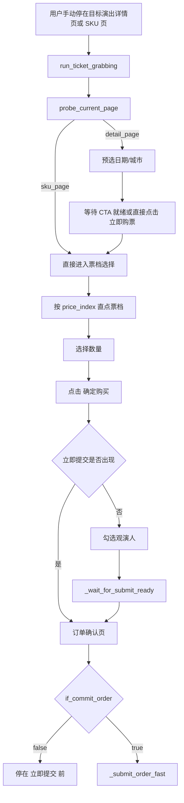

# Mobile 端抢票逻辑

> 源码目录: `mobile/`

## 技术栈

- Python 3.8+
- UIAutomator2 (u2) 直连 Android 设备，每次操作 ~30-60ms
- 无需额外服务进程，`adb devices` 能识别设备即可
- 仅支持 Android

## 模块结构

| 文件                   | 职责                                      |
| ---------------------- | ----------------------------------------- |
| `damai_app.py`         | 当前版本：`DamaiBot` 类，移动端抢票主流程 |
| `config.py`            | 配置容器 + `load_config()` 静态方法       |
| `config.jsonc`         | 默认运行配置，普通用户直接维护这个文件    |
| `config.local.jsonc`   | 开发者本地覆盖配置，默认不会自动启用      |
| `config.example.jsonc` | 配置样例                                  |

## 配置项 (`config.jsonc` / `config.local.jsonc`)

- `udid`: 设备序列号；真机建议填写 `adb devices` 的序列号
- `app_package`: 大麦 App 包名
- `app_activity`: 大麦启动 Activity
- `item_url`: 大麦详情页链接，脚本会自动提取 `itemId`
- `item_id`: 可直接填数字 `itemId`
- `keyword`: 搜索关键词；如果 `item_url` 可解析，可省略或填 `null`
- `users`: 观演人姓名列表
- `city`: 目标城市
- `date`: 目标日期
- `price`: 目标票价
- `price_index`: 票价在列表中的索引位置
- `if_commit_order`: 是否自动提交订单
- `probe_only`: 仅做详情页探测，不执行购票点击
- `auto_navigate`: 是否从大麦首页/搜索页自动进入目标演出
- `sell_start_time`: 开售时间（ISO 格式字符串），null 表示立即购买
- `countdown_lead_ms`: 提前轮询时间（毫秒），默认 3000
- `prefilled_detail_entry_lead_ms`: 预填正式模式提前进入 SKU 的时间，默认 300ms；`sell_start_time` 仍填写官方开售时间
- `wait_cta_ready_timeout_ms`: 当用户已手动停在倒计时详情页时，允许脚本直接等待 CTA 变成 `立即预定/立即购买` 的最长时长；默认 0 表示关闭
- `fast_retry_count`: 快速重试次数（不重建 driver），默认 8
- `fast_retry_interval_ms`: 快速重试间隔（毫秒），默认 80
- `rush_mode`: 抢票实战模式；更激进地信任 `price_index`，跳过冗余 UI 读取，热路径耗时可压缩到 2 秒以内；推荐开启

## 主流程

```
DamaiBot.__init__()
  ├── Config.load_config()    # 默认读取 config.jsonc；开发者可显式覆盖
  ├── _prepare_runtime_config()  # 解析 item_url/item_id，必要时自动补 keyword
  └── _setup_driver()         # 初始化 u2 设备连接

run_with_retry(max_retries=3)
  └── run_ticket_grabbing()   # 单次抢票流程
        ├── dismiss_startup_popups()       # 处理首启弹窗
        ├── check_session_valid()          # 登录状态检测
        ├── probe_current_page()           # 探测当前页面状态
        │   ├── 非目标演出页 => navigate_to_target_event()
        │   └── probe_only => 验证控件后提前结束
        ├── wait_for_sale_start()          # 倒计时等待 / CTA 就绪等待（可选）
        ├── 0. 选择场次日期
        ├── 1. 选择城市
        ├── 2. 点击预约按钮
        ├── 3. 选择票价（实战模式下优先直接按 `price_index` 点击）
        ├── 4. 选择数量
        ├── 5. 确定购买
        ├── 6. 选择用户
        ├── 7. 提交订单
        └── 8. 验证订单结果
```

当 `rush_mode=true`、`use_prefilled_selection=true` 且
`if_commit_order=true` 时，主流程改走独立的预填快速路径：

1. 在 `sell_start_time - prefilled_detail_entry_lead_ms` 点击详情页购票按钮；
2. 到 `sell_start_time` 后直接点击 SKU 右下角按钮，最多 3 次、间隔 250ms；
3. 仅通过 Activity 进入 `DmOrderActivity`/`OrderConfirmActivity` 判定跳转成功；
4. 等待 150ms 后点击右下角提交一次，再执行结果验证。

这条路径不读取 UI hierarchy，不检查票档、数量、观演人或提交按钮文案。

## 详细流程

### 1. 驱动初始化 (`_setup_driver`)

通过 UIAutomator2 直连设备：

```python
import uiautomator2 as u2
d = u2.connect(config.udid)    # 直连设备，无需额外服务进程
d.settings["wait_timeout"] = 2.0
d.settings["operation_delay"] = (0, 0)
d.app_start("cn.damai", stop=False)   # 不重启 App，保持登录态
self.driver = self.d
```

说明：

- 直连设备，省去中转层，每次操作 ~30-60ms
- `_find`、`_click_coordinates` 等方法统一封装元素查找和手势操作
- 热路径使用坐标缓存（`_cached_hot_path_coords`），重试时单次 HTTP 调用即可完成点击

**激进性能优化**:

```python
waitForIdleTimeout: 0       # 不等待页面空闲
actionAcknowledgmentTimeout: 0  # 禁止等待动作确认
keyInjectionDelay: 0        # 禁止输入延迟
waitForSelectorTimeout: 100  # 元素查找超时 100ms
enableNotificationListener: False  # 禁用通知监听
```

**显式等待**: `WebDriverWait` 超时仅 2 秒（常规为 5-10 秒）

### 2. 点击优化

这是 Mobile 端的核心设计。

**`ultra_fast_click()`** — 单元素极速点击:

```python
# 不等待 clickable 状态，只等 presence
el = WebDriverWait(driver, 1.5).until(
    EC.presence_of_element_located(locator)
)
# 获取坐标，用 gesture 替代 element.click()
rect = el.rect
driver.execute_script("mobile: clickGesture", {
    "x": center_x, "y": center_y,
    "duration": 50  # 极短点击时间
})
```

**为什么用坐标点击？**

- `element.click()` 需要等待元素 clickable、可见性检查等，开销大
- `clickGesture` 直接在屏幕坐标执行手势，绕过所有检查

**`ultra_batch_click()`** — 批量用户选择优化:

1. 先**批量收集**所有目标元素的坐标（一次遍历）
2. 再**快速连续点击**所有坐标（元素间 delay 仅 0.01s）
3. 避免了"找一个点一个"的串行等待

**`smart_wait_and_click()`** — 智能备选点击:

- 接受主选择器 + 备用选择器列表
- 依次尝试，第一个成功即返回

### 3. 启动探测和安全探针

**`dismiss_startup_popups()`**

- 处理 Android 全屏提示
- 处理大麦隐私协议弹窗
- 处理系统级 `Add to home screen` 取消按钮

**`probe_current_page()`**

- 探测 `consent_dialog`、`homepage`、`search_page`、`detail_page`、`order_confirm_page`
- 同时返回关键控件是否可见：
  - `purchase_button`
  - `price_container`
  - `quantity_picker`
  - `submit_button`
- 对 `sku_page` 额外识别 `reservation_mode`，避免误把“抢票预约”当成正式下单
- 同时输出当前 Activity，方便定位卡在首页、搜索页还是订单页

**`probe_only` 模式**

- 只验证详情页关键控件是否就绪
- 就绪后停止在真正购票点击前
- 适合首次接设备、校验页面、验证选择器

### 4. 自动导航到目标演出

当配置了 `item_url` 或 `item_id` 时，脚本会在启动前先解析演出详情：

- 自动提取 `itemId`
- 读取演出名、城市、场馆、时间范围
- 在 `keyword` 为空时自动生成搜索关键词
- 校验 `config.city` 是否与链接指向城市一致

如果当前页面不在目标演出详情页，且 `auto_navigate=true`，脚本会：

1. 从首页进入搜索页
2. 用解析出的 `keyword` 搜索
3. 对搜索结果按标题/城市/场馆打分
4. 点击最匹配的演出并进入详情页

这一步的目标是把“用户只给链接，其余自动处理”落到项目里，而不是依赖用户先手动点到详情页。

### 5. 抢票各步骤

**城市选择**: 三种选择器备选

1. `UiSelector().text("城市名")` — 精确匹配
2. `UiSelector().textContains("城市名")` — 模糊匹配
3. XPath `//*[@text="城市名"]` — 兜底

**预约按钮**: 三种选择器备选

1. 按资源 ID 定位 (`cn.damai:id/...`)
2. 正则匹配文本 (`.*预约.*|.*购买.*|.*立即.*`)
3. XPath 文本包含

**票价选择**: 两级策略

1. 先尝试 `UiSelector().textContains(config.price)` 文本匹配（1 秒超时）
2. 文本匹配失败时，回退到 `FrameLayout` 的 **index** + `clickable=true` 定位
   - 大麦 APP 的票价元素有时 **text 是空的**（被隐藏了），此时只能用索引
   - 配置中的 `price_index` 就是为此设计的
   - 先尝试 `find_element` 直接查找（不等待），失败后走 `WebDriverWait`

**`rush_mode=true` 时的额外优化**:

- 详情页“立即购票”按钮会走更短等待的快速二次尝试，但仍保留稳定的选择器路径
- 票档优先直接按 `price_index` 点击，不再先扫描所有可见票档文本
- SKU 页“确定购买”会走连续快速点击，并缩短确认页轮询间隔
- 这是偏实战的模式，核心目标是压缩热路径；前提是你已经通过 `probe_only` / 到确认页验证过 `price_index` 没配错

**手动倒计时页实战模式**:

- 用户自己先进入目标演出详情页，并停在倒计时抢票界面
- 配置 `auto_navigate=false`、`rush_mode=true`
- 如果不想依赖精确开售时间，可把 `sell_start_time=null`，同时设置 `wait_cta_ready_timeout_ms`
- 脚本会先预选日期/城市，然后只等待 CTA 变成 `立即预定/立即购买`，一旦就绪就直接进入热路径
- 如果本轮失败，快速重试会优先在当前会话里回退到演出详情页再重进，不会先重建 driver 把页面打回首页
- 详细工作流图见 [2026-03-30-mobile-hot-path-workflow-design.md](./plans/2026-03-30-mobile-hot-path-workflow-design.md)
- 可编辑图源: [移动端热路径工作流.drawio](./移动端热路径工作流.drawio)
- 静态图片: [移动端热路径工作流.png](./images/移动端热路径工作流.png)



**手动起跑热路径压测脚本**:

- 入口: `./mobile/scripts/benchmark_hot_path.sh`
- 默认读取 `mobile/config.jsonc`；如果开发者显式设置 `--config` 或 `HATICKETS_CONFIG_PATH`，则按指定路径读取；不会写回配置
- 会强制使用安全参数: `if_commit_order=false`、`auto_navigate=false`、`rush_mode=true`
- 报告分两段：**第 1 轮标记为 `[冷启动]`**（App SKU 数据未缓存，约 2-3s）；**热重试 avg/min/max** 仅统计第 2 轮起（缓存已热，约 1-2s）；真实抢票中只有冷启动这一次最关键
- 常用示例:
  `./mobile/scripts/benchmark_hot_path.sh --runs 5`
  `./mobile/scripts/benchmark_hot_path.sh --runs 5 --price 580元 --price-index 2 --city 成都 --date 04.18`

**数量选择**:

- 查找 `+` 按钮（`img_jia`）
- 获取坐标后用 `clickGesture` 点击 (用户数 - 1) 次
- 每次点击间隔仅 0.02s

**用户选择**: 使用 `ultra_batch_click()`

- 为每个用户名构造 `UiSelector().text("用户名")` 选择器
- 批量收集坐标后快速连续点击

**提交订单**: 三种选择器备选

1. `UiSelector().text("立即提交")`
2. 正则匹配 `.*提交.*|.*确认.*`
3. XPath 文本包含

### 6. 重试机制

`run_with_retry(max_retries=3)`:

- 最多尝试 3 次
- 每次失败后先执行 `fast_retry_count` 次快速重试（不重建 driver）
- 第一轮快速重试会立即执行，后续重试间隔由 `fast_retry_interval_ms` 控制（默认 80ms）
- 快速重试根据当前页面状态决定策略：detail/sku 页重跑全流程，order_confirm 页直接提交，其他页按返回键后重跑
- 如果处于 `if_commit_order=false` 且已经在确认页，快速重试只验证“立即提交”按钮存在，不会误提交
- 如果识别到 `reservation_only`、登录失效等不可重试场景，会直接停止后续重试，缩短整体耗时
- 全部快速重试失败后，才重建 driver（`driver.quit()` + `_setup_driver()`）
- 全部失败则退出

### 7. 倒计时/预售等待

`wait_for_sale_start()`:

- 当 `sell_start_time` 配置不为 null 时，在开售前 `countdown_lead_ms` 毫秒进入休眠等待
- 休眠结束后进入 ~80ms 间隔的紧密轮询循环，同时检测详情页 CTA、SKU 页、确认页等多个开售信号
- 超时 8 秒后自动继续执行，避免死锁
- `sell_start_time` 为 null 时立即购买，不等待

### 8. 订单结果验证

`verify_order_result(timeout=5)`:

- 提交订单后轮询检测结果（300ms 间隔）
- 通过 Activity 名称判断支付页面（Pay、Cashier、AlipayClient）
- 通过页面文本检测：支付成功、已售罄、库存不足、验证码、未支付订单等
- 返回值：`success` / `sold_out` / `captcha` / `existing_order` / `timeout`

### 9. 登录状态检测

`check_session_valid()`:

- 在抢票流程开始前检查登录状态
- 检测当前 Activity 是否为登录页（LoginActivity、SignActivity）
- 检测页面是否存在"请先登录"或"登录/注册"文本提示
- 登录失效时立即返回 False，避免无效执行

### 10. 演出日期选择

`select_performance_date()`:

- 在城市选择之前执行，通过 `UiSelector().textContains()` 匹配 `config.date`
- 匹配成功则点击对应日期，失败则使用默认场次
- 超时仅 1 秒，不阻塞主流程

#### 多场次活动配置示例

巡演 / 音乐节 / 多日演出在 SKU 面板会先出现「请选择场次」/「选择日期」卡片。
`page_probe` 识别后会进入 `session_picker` 状态并调用
`event_navigator.select_session()`，匹配优先级：
`date + city` 精确 → `date` 唯一 → `fallback_index=0`。

```jsonc
{
  "keyword": "张杰 演唱会",
  "users": ["张三"],
  "city": "上海",          // 巡演 → 同一日期可能多城，city 是去重关键
  "date": "04.06",          // 统一为 MM.DD 格式（normalize_date 输出）
  "price": "780元",
  "price_index": 2,
  "rush_skip_session": false  // 多场次必须 false；alias rush_mode=true 也会强制 false
}
```

匹配失败会抛 `SessionNotFoundError` 并将运行结果标为
`session_not_found`，不会盲点。日期格式可写
`4月6号 / 04-06 / 04.06 / 2026-04-06`，`date_utils.normalize_date()` 统一归一为
`MM.DD` 后再比对。

### 11. 改进的票价选择

票价选择采用两级策略：

1. **文本匹配优先**：通过 `UiSelector().textContains(config.price)` 直接匹配票价文本
2. **索引回退**：文本匹配失败时，回退到原有的 `FrameLayout` index + `clickable=true` 定位方式
   - 先尝试 `find_element` 直接查找（不等待）
   - 失败后走 `WebDriverWait` 等待容器出现再查找

这种两级策略兼容了票价文本可见和不可见两种情况。

## 前置条件

运行前需要：

1. 用户已手动打开大麦 APP 并登录
2. 如果使用 `item_url + auto_navigate`，可以停留在首页；否则仍需手动进入目标演出详情页
3. `adb devices` 能识别设备即可，无需额外服务进程

## MVP 验证结论

`2026-03-29` 的真实模拟器测试结论：

- Android 模拟器 + 大麦 App 可以正常启动和探测页面
- 大麦首启弹窗可以通过启动探测层稳定处理
- 目标商品的 deeplink 会短暂进入 `ProjectDetailActivity`，随后回到首页，不适合作为默认导航方案
- 当前默认方案改为：优先用 `item_url + auto_navigate` 从首页搜索进入目标演出；手动打开详情页仅作为回退方案

## 平台限制

- **仅 Android**: UIAutomator2 仅支持 Android
- **不支持 iOS**: 需要 XCUITest 引擎 + 完全不同的元素定位方式
- **不支持选座**: 流程中没有选座步骤

## 真机配置建议

1. 用 `adb devices` 确认真机已经连上
2. 把设备序列号填进 `config.jsonc` 的 `udid`
3. `adb devices` 确认设备已连接即可，无需额外配置
4. 如果大麦版本或 ROM 定制导致启动页不同，再覆盖 `app_activity`

## 性能设计理念

整体设计以**速度优先**为核心：

- 所有等待时间压缩到最短（0.01s~2s）
- 禁用一切不必要的系统功能（动画、通知、空闲检测）
- 用坐标点击替代元素交互
- 批量操作先收集再执行，减少串行等待
